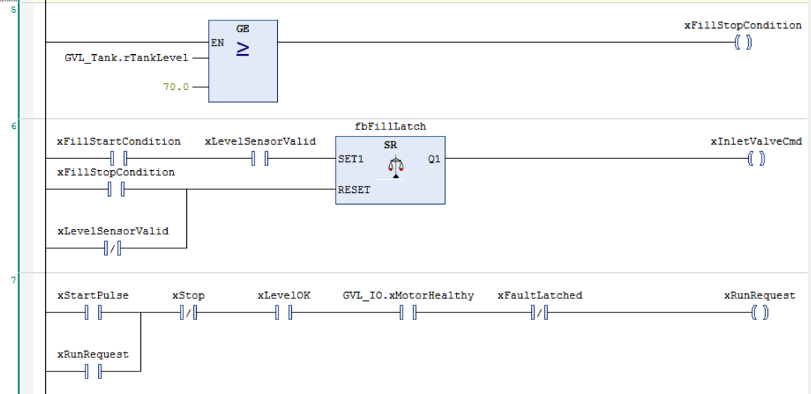
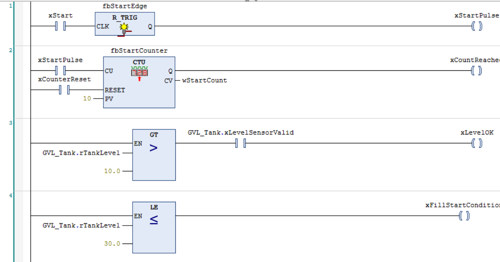
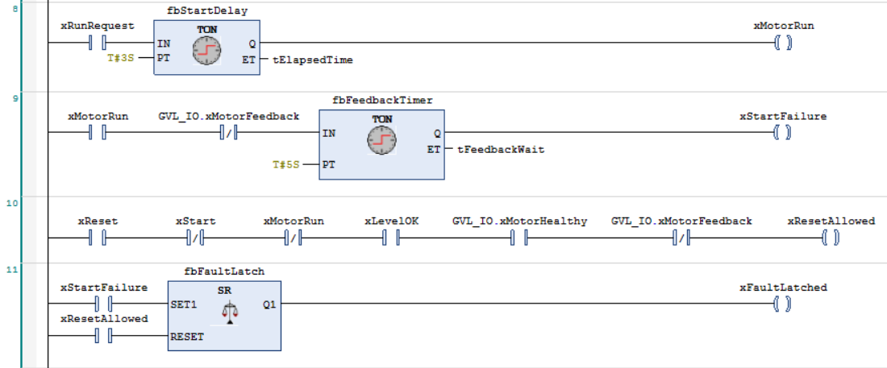
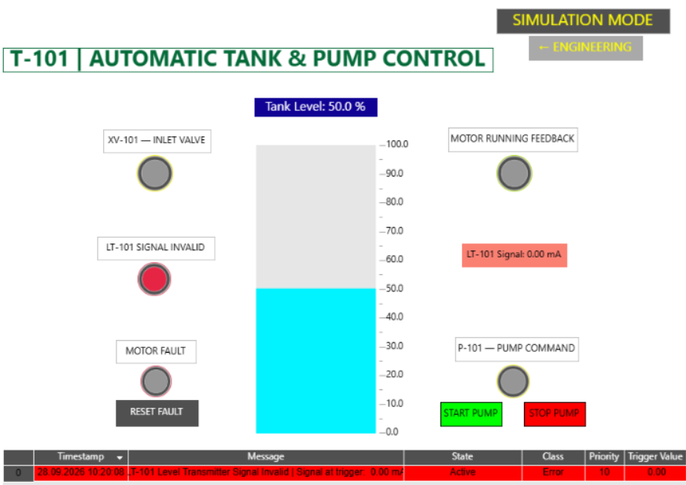
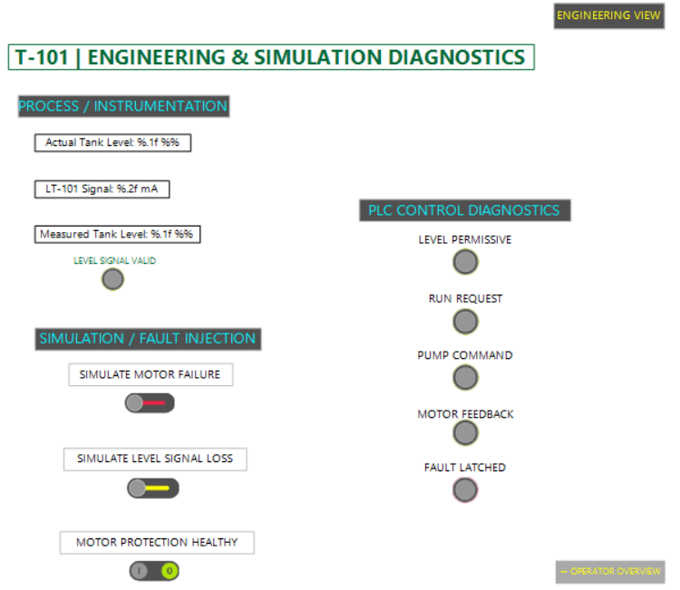

# Industrial Tank & Pump Control System — CODESYS PLC/HMI

A simulated industrial tank and pump control system developed in **CODESYS** as a practical portfolio project in industrial automation, PLC programming, instrumentation and HMI design.

The project combines **Ladder Diagram (LD)** and **Structured Text (ST)** and implements a complete control sequence including automatic tank filling, pump permissives and interlocks, start-delay logic, motor feedback supervision, fault latching, simulated 4–20 mA instrumentation, alarm handling and engineering diagnostics.

> This project is a software-based simulation created for learning and portfolio purposes.  
> It has not been commissioned on a physical industrial PLC or field installation.

---

## Operator Overview


The operator HMI provides the main process view for the simulated T-101 tank system.

It includes:

- Tank level indication
- XV-101 inlet valve status
- P-101 pump command status
- Motor running feedback
- LT-101 signal validity
- Motor fault indication
- START / STOP controls
- Fault reset
- Alarm table

---

## System Overview

The simulated process consists of:

- **T-101** — Process tank
- **LT-101** — Simulated level transmitter
- **XV-101** — Tank inlet valve
- **P-101** — Process pump
- Motor protection status
- Motor running feedback
- PLC control and fault supervision
- Operator and engineering HMI views

The control architecture can be summarized as:

```text
Simulated Physical Tank
        |
        v
LT-101 Level Transmitter
     4–20 mA
        |
        v
Signal Validation & Scaling
        |
        v
Measured Tank Level
        |
        v
PLC Permissives / Interlocks
        |
        v
Pump & Valve Control
        |
        v
Motor Feedback Supervision
        |
        v
Fault Handling / Alarm System
        |
        +------> Operator HMI
        |
        +------> Engineering Diagnostics


## Key Features

### PLC Control

- PLC logic developed using **Ladder Diagram (LD)** and **Structured Text (ST)**
- Rising-edge detection using `R_TRIG`
- Latched pump run request
- Pump start delay using `TON`
- Motor running feedback supervision
- Feedback timeout and motor start-failure detection
- Fault memory using an `SR` latch
- Controlled manual fault reset
- Process permissives and interlocks
- Automatic inlet valve control
- Tank filling hysteresis
- Start-event counter implemented during development and testing

### Instrumentation

- Simulated **4–20 mA LT-101 level transmitter**
- Conversion between physical tank level and transmitter current
- Analog signal validation
- Scaling from 4–20 mA to 0–100 %
- Invalid transmitter signal detection
- High-high tank level alarm

### Process Simulation

- Dynamic tank-level simulation
- Configurable inlet and outlet flow rates
- Simulated motor startup delay
- Automatic motor-running feedback
- Motor failure fault injection
- LT-101 signal-loss fault injection
- Separation between actual physical process value and PLC measured value

### HMI & Diagnostics

- Operator overview
- Engineering diagnostics view
- Tank-level indication
- Pump command and feedback indication
- Valve status
- Instrument signal diagnostics
- Internal PLC-state visualization
- Simulation fault-injection controls
- Alarm table with timestamp, class, priority and trigger value

---

## Control Philosophy

### Automatic Tank Filling

Tank filling is controlled using two level thresholds:

- **Level ≤ 30 %** → filling is requested
- **Level ≥ 70 %** → filling is stopped

An `SR` latch is used to maintain the inlet-valve command between these two thresholds.

This creates **hysteresis**, preventing the inlet valve from repeatedly opening and closing around a single switching point.



The sequence can be represented as:

```text
Level <= 30 %
      |
      v
SET filling request
      |
      v
XV-101 OPEN
      |
      v
Tank fills
      |
      v
Level >= 70 %
      |
      v
RESET filling request
      |
      v
XV-101 CLOSED
```

If the LT-101 measurement becomes invalid, automatic filling is inhibited and the valve is driven to its safe control state.

---

## Pump Start Sequence

Pump starting is allowed only when the necessary process and equipment conditions are satisfied.

Typical start permissives include:

- Tank level above the minimum operating limit
- Valid LT-101 level measurement
- Healthy motor protection
- No latched start fault
- Stop command inactive

The START command is processed through an `R_TRIG` rising-edge detector.

This converts the operator action into a one-cycle pulse instead of treating the START button as a permanently active command.

The start pulse creates a latched run request.



The normal sequence is:

```text
START command
      |
      v
Rising-edge detection
      |
      v
Run request latched
      |
      v
Permissives checked
      |
      v
3 s start delay
      |
      v
Pump command
      |
      v
Wait for motor feedback
```

---

## Motor Command and Running Feedback

The project deliberately distinguishes between:

- **Pump command**
- **Actual motor running feedback**

These two signals are not assumed to be identical.

In a real industrial system, the PLC can issue a start command while the motor fails to run because of an equipment, power, contactor, drive or protection fault.

The simulation therefore generates motor-running feedback separately after a simulated startup delay.

```text
Pump Command = TRUE
       |
       v
Simulated startup delay
       |
       v
Motor Feedback = TRUE
```

When simulated motor failure is enabled, the PLC can still issue the pump command, but the running feedback remains inactive.

This allows the motor supervision and fault-handling logic to be tested.

---

## Motor Start Failure Supervision

When:

```text
Pump Command = TRUE
```

while:

```text
Motor Feedback = FALSE
```

the feedback supervision timer begins counting.

If the expected motor-running feedback does not arrive within the configured time, a start failure is generated.

The failure is then stored using an `SR` latch.



The sequence is:

```text
Pump Command
     +
No Motor Feedback
        |
        v
Feedback Timer
        |
        v
Start Failure
        |
        v
SR Fault Latch
        |
        v
Fault remains stored
until permitted manual reset
```

The use of a latch is important because the original failure condition may disappear after the pump command is removed.

Without fault memory, the operator could lose the information that a failed start occurred.

---

## Fault Reset Logic

A latched motor fault cannot be cleared under arbitrary conditions.

Reset is permitted only when the equipment has returned to an appropriate safe state.

The reset permissive logic checks conditions including:

- Reset command active
- START command inactive
- Pump command inactive
- Required process permissives restored
- Motor protection healthy
- Motor feedback inactive

This prevents the fault from being cleared while the equipment is still being commanded to run or while an unsafe condition remains present.

---

## 4–20 mA Level Instrumentation

One of the main objectives of the project was to model the difference between:

1. The **actual physical process value**
2. The **field transmitter signal**
3. The **engineering value used by the PLC**

The physical simulated tank level is therefore stored separately from the PLC-measured level.

The simulated LT-101 transmitter converts tank level into a standard **4–20 mA industrial analog signal**.

Typical values are:

```text
0 %   -> 4 mA
50 %  -> 12 mA
100 % -> 20 mA
```

The simulated transmitter uses:

```text
I[mA] = 4 + (Level[%] / 100) × 16
```

The PLC input-processing logic converts the current back into engineering units using:

```text
Level[%] = ((I[mA] - 4) / 16) × 100
```

The resulting signal chain represents the basic principle of a real industrial measurement system:

```text
Physical Tank Level
        |
        v
LT-101 Level Transmitter
        |
        v
4–20 mA Signal
        |
        v
PLC Analog Input
        |
        v
Signal Validation
        |
        v
Scaling
        |
        v
Engineering Value (%)
```

---

## Level Signal Validation

Before the tank level is used by the control logic, the simulated analog signal is validated.

A normal LT-101 signal is expected to remain inside the valid 4–20 mA measurement range.

When level-transmitter signal loss is simulated:

```text
LT-101 current = 0 mA
```

the PLC detects the measurement as invalid.

The system then:

- Sets the level-signal fault
- Sets the level measurement as invalid
- Removes level-dependent permissives
- Prevents process decisions from relying on an invalid measurement
- Generates an LT-101 alarm
- Retains the last valid measured tank level for diagnostics

This demonstrates the difference between:

**what is physically happening in the process**

and

**what information is currently available to the controller**.

---

## High-High Level Alarm

A high-high process alarm is generated when:

```text
Tank Level >= 90 %
```

provided that the LT-101 measurement is valid.

The validity condition is important because an invalid transmitter signal should not incorrectly create a process high-level alarm.

The alarm configuration also captures the tank level at the moment of alarm activation using a latch value.

---

## Alarm Management



The CODESYS Alarm Management system is used to present important process and equipment faults to the operator.

Implemented alarm conditions include:

- **LT-101 level transmitter signal invalid**
- **P-101 motor start failure / fault latched**
- **P-101 motor protection not healthy**
- **T-101 high-high level**

The alarm table displays information such as:

- Timestamp
- Alarm message
- State
- Alarm class
- Priority
- Trigger value

The project was also used to explore alarm acknowledgement, alarm-state transitions and the distinction between active process conditions and stored alarm information.

---

## Engineering Diagnostics



A separate Engineering & Simulation Diagnostics visualization was created to expose internal control states without cluttering the normal operator interface.

The screen is divided into three main areas.

### Process / Instrumentation

Displays:

- Actual tank level
- LT-101 transmitter current
- PLC measured tank level
- Level signal validity

This allows the complete measurement chain to be observed:

```text
Actual Level
     |
     v
LT-101 Current
     |
     v
Measured Level
     |
     v
Signal Validation
```

### PLC Control Diagnostics

Displays:

- Level permissive
- Run request
- Pump command
- Motor feedback
- Fault latched

This makes it possible to observe the internal sequence of the controller directly from the HMI.

For example:

```text
Run Request
     |
     v
Pump Command
     |
     v
Motor Feedback
```

During a simulated failure:

```text
Pump Command = TRUE
Motor Feedback = FALSE
        |
        v
Feedback timeout
        |
        v
Fault Latched = TRUE
```

### Simulation / Fault Injection

Provides engineering controls for:

- Simulating motor failure
- Simulating LT-101 signal loss
- Changing the simulated motor-protection healthy state

These controls are intentionally separated from the normal operator interface because they represent engineering/testing functions rather than normal plant-operation commands.

---

## PLC Program Structure

The application is divided into several logical components.

### `PLC_PRG`

Main PLC control program, implemented primarily in Ladder Diagram.

Responsibilities include:

- Start/stop processing
- Rising-edge detection
- Run-request latching
- Level permissives
- Automatic tank filling
- Inlet-valve control
- Pump start delay
- Pump command
- Motor-feedback supervision
- Fault detection
- Fault latching
- Reset permissives
- Development/test counter logic

---

### `PRG_TankSimulation`

Structured Text program representing the simulated physical process.

Responsibilities include:

- Tank filling
- Tank discharge
- Physical level limiting to 0–100 %
- Motor startup simulation
- Motor-running feedback generation
- 4–20 mA LT-101 signal simulation
- Motor-failure injection
- Level-transmitter signal-loss injection

---

### `PRG_LevelInputProcessing`

Structured Text program responsible for processing the simulated analog measurement.

Responsibilities include:

- Analog signal-range validation
- Level-signal fault generation
- 4–20 mA scaling
- Measured tank-level calculation
- High-high process alarm calculation

---

### `GVL_Tank`

Contains global process and instrumentation variables.

Examples include:

```text
rActualTankLevel
rLevelCurrent_mA
rTankLevel
xLevelSensorValid
xLevelSignalFault
xHighHighLevelAlarm
```

---

### `GVL_IO`

Contains global simulated equipment and field signals.

Examples include:

```text
xMotorFeedback
xMotorHealthy
xSimulateMotorFailure
xSimulateLevelSignalLoss
```

---

## Ladder Logic

The main sequencing, permissive and fault-handling logic is implemented using Ladder Diagram to reflect a common industrial PLC programming approach.

The project makes use of:

- Normally open contacts
- Negated contacts
- Coils
- Parallel branches
- `R_TRIG`
- `TON`
- `CTU`
- `SR`
- Comparison blocks (`GT`, `LE`, `GE`)
- Seal-in / holding logic
- Permissive chains
- Interlocks

The complete Ladder implementation is included in the original CODESYS project and export files inside the [`project/`](project/) directory.

---

## Structured Text Source

Readable Structured Text source files are provided under [`source/`](source/) for convenient inspection directly from GitHub.

Files include:

- [`GVL_IO.st`](source/GVL_IO.st)
- [`GVL_Tank.st`](source/GVL_Tank.st)
- [`PRG_LevelInputProcessing.st`](source/PRG_LevelInputProcessing.st)
- [`PRG_TankSimulation.st`](source/PRG_TankSimulation.st)

The original CODESYS project additionally contains the complete Ladder Diagram logic, visualization configuration and alarm configuration.

---

## Functional Testing

The completed control system was tested against multiple functional scenarios.

The main scenarios include:

1. Normal pump startup
2. Motor start / feedback failure
3. LT-101 transmitter signal loss
4. Automatic tank filling between 30 % and 70 %
5. High-high tank level alarm
6. Latched motor-fault reset

Detailed test steps, initial conditions and expected results are documented in:

[Functional Test Scenarios](docs/test-scenarios.md)

---

## Repository Structure

```text
industrial-tank-control-codesys/
|
|-- project/
|   |-- Industrial_Tank_Control.project
|   `-- Industrial_Tank_Control.export
|
|-- source/
|   |-- GVL_IO.st
|   |-- GVL_Tank.st
|   |-- PRG_LevelInputProcessing.st
|   `-- PRG_TankSimulation.st
|
|-- docs/
|   |-- test-scenarios.md
|   |
|   `-- screenshots/
|       |-- operator-overview.png
|       |-- engineering-diagnostics.png
|       |-- ladder-start-permissives.png
|       |-- ladder-filling-control.png
|       |-- ladder-fault-handling.png
|       `-- alarm-management.png
|
|-- .gitignore
`-- README.md
```

---

## Opening the Project

### Requirements

The project was developed using:

- **CODESYS Development System V3.5**
- CODESYS Control Win target / simulation environment

To inspect the complete PLC application:

1. Install CODESYS Development System.
2. Download or clone this repository.
3. Open:

```text
project/Industrial_Tank_Control.project
```

Alternatively, the exported project objects are available at:

```text
project/Industrial_Tank_Control.export
```

The standalone `.st` files inside `source/` are included mainly to make the Structured Text code easy to inspect directly from GitHub.

---

## Limitations

This project is a **software-based engineering simulation** and not a commissioned industrial control system.

The current implementation does not include:

- Physical PLC hardware
- Physical 4–20 mA analog I/O modules
- Real LT-101 level transmitter
- Real motor starter or variable-frequency drive
- Real industrial communications network
- Modbus TCP integration
- OPC UA integration
- SCADA integration
- Historical process trending
- Safety PLC / SIL implementation
- Production OT cybersecurity architecture

The project should therefore be considered a practical PLC/HMI learning and portfolio system rather than production-ready industrial control software.

---

## Future Development

Potential extensions include:

- Deployment to physical PLC hardware
- Integration with real analog I/O
- Physical 4–20 mA transmitter testing
- Variable-frequency drive control
- Modbus TCP communication
- OPC UA communication
- SCADA integration
- Historical process trending
- Extended alarm and event logging
- Additional field instrumentation
- Manual / automatic operating modes
- PID-based process control
- Industrial network segmentation
- OT system architecture and security concepts

---

## Skills Demonstrated

This project provided practical exposure to:

- IEC 61131-3 PLC programming
- Ladder Diagram
- Structured Text
- PLC cyclic execution concepts
- Timers and counters
- Rising-edge detection
- Interlocks
- Permissives
- Equipment command / feedback philosophy
- Fault detection
- Fault latching and reset logic
- Automatic process control
- Industrial alarm handling
- 4–20 mA instrumentation
- Analog signal scaling
- Signal validation
- Process simulation
- HMI development
- Engineering diagnostics
- Fault injection
- Functional test design

---

## Author

**Georgios Tsantikis**  
Electrical & Computer Engineer  
Aristotle University of Thessaloniki (AUTH)

GitHub: [@geotsad](https://github.com/geotsad)
