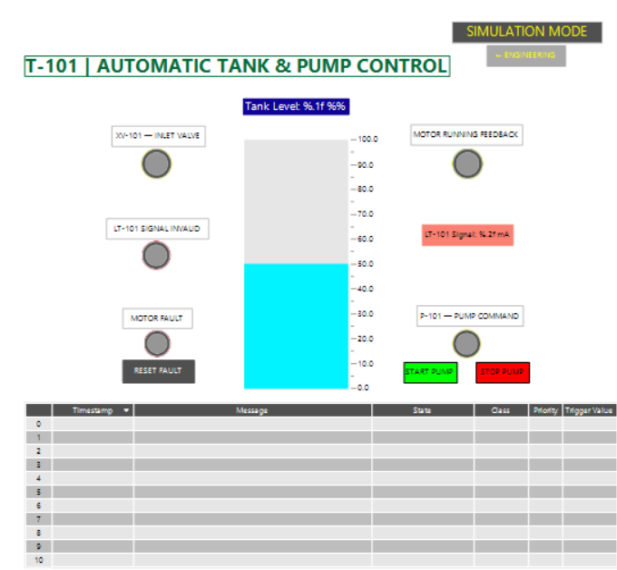

# Industrial Tank & Pump Control System — CODESYS PLC/HMI

A simulated industrial tank and pump control system developed in **CODESYS** as a practical portfolio project in industrial automation, PLC programming, instrumentation and HMI design.

The project combines **Ladder Diagram (LD)** and **Structured Text (ST)** and implements a complete control sequence including automatic tank filling, pump permissives and interlocks, start-delay logic, motor feedback supervision, fault latching, simulated 4–20 mA instrumentation, alarm handling and engineering diagnostics.

> This project is a software-based simulation created for learning and portfolio purposes.  
> It has not been commissioned on a physical industrial PLC or field installation.

---

## Operator Overview



The operator HMI provides the main process view for the simulated T-101 tank system.

It includes:

- Tank level indication
- XV-101 inlet valve status
- P-101 pump command status
- Motor running feedback
- LT-101 signal validity
- Motor fault indication
- START / STOP controls
- Fault reset
- Alarm table

---

## System Overview

The simulated process consists of:

- **T-101** — Process tank
- **LT-101** — Simulated level transmitter
- **XV-101** — Tank inlet valve
- **P-101** — Process pump
- Motor protection status
- Motor running feedback
- PLC control and fault supervision
- Operator and engineering HMI views

The control architecture can be summarized as:

```text
Simulated Physical Tank
        |
        v
LT-101 Level Transmitter
     4–20 mA
        |
        v
Signal Validation & Scaling
        |
        v
Measured Tank Level
        |
        v
PLC Permissives / Interlocks
        |
        v
Pump & Valve Control
        |
        v
Motor Feedback Supervision
        |
        v
Fault Handling / Alarm System
        |
        +------> Operator HMI
        |
        +------> Engineering Diagnostics
